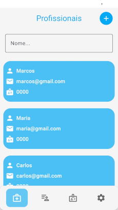
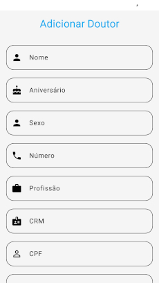
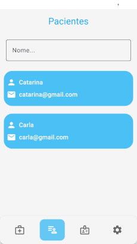
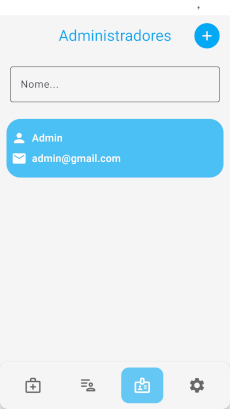
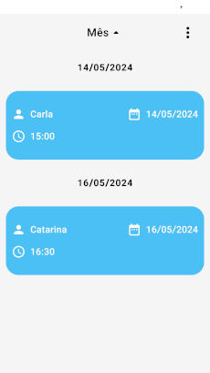
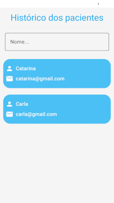
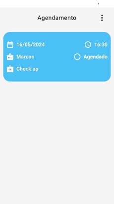
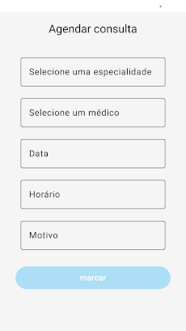

# ClinicaCare
An app for booking medical appointments build with jetpack compose, kotlin and MVVM architecture.

## Built With
- [Kotlin](https://kotlinlang.org/) - Official programming language for Android development.
- [Coroutines](https://kotlinlang.org/docs/reference/coroutines-overview.html) - For asynchronous and more..
- [Jetpack Compose](https://developer.android.com/jetpack/compose) - Google ui toolkit.
- [RealmDb](https://www.mongodb.com/docs/atlas/device-sdks/) - Open source object database.
- [Hilt](https://developer.android.com/training/dependency-injection/hilt-android) - For dependency injection
- [MVVM](https://en.wikipedia.org/wiki/Model%E2%80%93view%E2%80%93viewmodel) Architecture
- [Android Architecture components](https://developer.android.com/topic/libraries/architecture) ([ViewModel, ](https://developer.android.com/topic/libraries/architecture/viewmodel) [Compose navigation](https://developer.android.com/jetpack/compose/navigation))

## Build-tool
You need to have [Android Studio](https://developer.android.com/studio/preview) to build this project.

## Preview
  
 

 

 